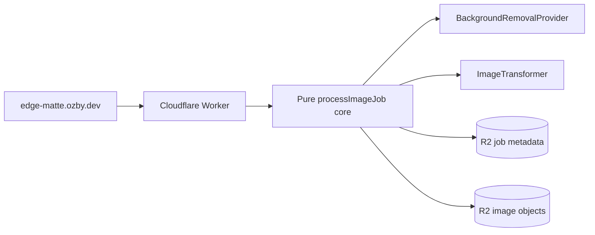

# EdgeMatte

Cloudflare-native TypeScript reference app for image matting pipelines: upload one image, remove its background through a provider adapter, flip it at the edge, host the result in R2, and delete every artifact with a capability token.

## Live demo

**[https://edge-matte.ozby.dev](https://edge-matte.ozby.dev)** — drag an image in, watch the spinner cycle through the four processing phases, copy the hosted URL, then delete.

```
curl -sf https://edge-matte.ozby.dev/health
```

## Architecture at a glance



- **Hono** routes inside one Cloudflare Worker.
- **Cloudflare-native background removal** via the `cf.image segment: "foreground"` CDN transform (BiRefNet under the hood). The provider issues a Worker sub-request to a prefix-gated `/internal/raw/segment-tmp/...` route so the CDN can apply the transform, then cleans the temp object. Swap-friendly via the `BackgroundRemovalProvider` port.
- **Cloudflare Images** binding for the horizontal flip (no library, no upload, native edge transform).
- **R2** holds both the image bytes and the job metadata.
- **Capability-token delete**: the create response returns a SHA-256-verified `deleteToken`; only the hash is persisted in R2.

## Run locally

Node `>=24`, pnpm `11.1.1`.

```
pnpm install --frozen-lockfile
```

### No-setup path — mock pipeline (recommended for a quick look)

Background removal in production uses Cloudflare's native `cf.image segment: "foreground"` CDN transform (BiRefNet) via a Worker sub-request — no external API key required. The mock pipeline swaps that path for in-memory mocks so the full upload → process → host → delete flow works without any Cloudflare account setup.

```
cd apps/worker
pnpm dev:mock
```

(`dev:mock` is `wrangler dev --var E2E_MOCK_PIPELINE:1`; the shell-only `E2E_MOCK_PIPELINE=1` form does **not** propagate to Workers `env` and will land on the real cf.image path, which 502s in miniflare.)

Then open the URL printed by `wrangler dev` and exercise the UI.

## Code tour

Where to start if you want to read the actual implementation:

| File                                                                                                                                     | What it does                                                                                                                                                      |
| ---------------------------------------------------------------------------------------------------------------------------------------- | ----------------------------------------------------------------------------------------------------------------------------------------------------------------- |
| [`apps/worker/src/adapters/hono/app.ts`](./apps/worker/src/adapters/hono/app.ts)                                                         | All five HTTP routes (`POST /api/jobs`, `GET /api/jobs/:id`, `GET /i/:id`, `DELETE /api/jobs/:id`, `GET /health`). Shared error envelope.                         |
| [`apps/worker/src/core/process-image-job.ts`](./apps/worker/src/core/process-image-job.ts)                                               | Pure pipeline: validate → upload → bg-removal → flip → store → respond. Adapters are dependency-injected; the core knows nothing about Cloudflare.                |
| [`apps/worker/src/core/image-job.ts`](./apps/worker/src/core/image-job.ts)                                                               | Job lifecycle, delete-token verification, URL derivation.                                                                                                         |
| [`apps/worker/src/core/errors.ts`](./apps/worker/src/core/errors.ts)                                                                     | `AppError` + the closed set of error codes the frontend translates.                                                                                               |
| [`apps/worker/src/adapters/cloudflare/cf-image-segment-provider.ts`](./apps/worker/src/adapters/cloudflare/cf-image-segment-provider.ts) | `cf.image segment: "foreground"` via a Worker sub-request. Stores a temp blob under `segment-tmp/`, applies the CDN transform, cleans up in `finally`. Abortable. |
| [`apps/worker/src/adapters/cloudflare/images-transformer.ts`](./apps/worker/src/adapters/cloudflare/images-transformer.ts)               | One-call horizontal flip via the Workers Images binding.                                                                                                          |
| [`apps/client/src/state.ts`](./apps/client/src/state.ts)                                                                                 | Eight-phase UI state machine — `idle → preview → uploading → processing → ready → confirm-delete → deleted`, plus `error`.                                        |
| [`apps/client/src/app.ts`](./apps/client/src/app.ts)                                                                                     | Controller. Wires `selectFile / submitUpload / requestDelete / confirmDelete / reset / copyResultUrl`.                                                            |
| [`apps/client/src/ui.ts`](./apps/client/src/ui.ts)                                                                                       | DOM template + render — semantic HTML, `aria-live` status, no framework.                                                                                          |

The Worker entrypoint at [`apps/worker/src/index.ts`](./apps/worker/src/index.ts) is the dependency-injection seam: production wires the `cf.image segment` provider + Cloudflare Images flip + R2; tests use in-memory mocks via the same port interfaces.

## Tests

```
pnpm install --frozen-lockfile
pnpm run test                              # unit + integration (worker, client, root)
pnpm run e2e -- --suite upload-delete-contract  # HTTP contract: upload→serve→delete + every error code
pnpm run e2e -- --suite smoke              # /health + SPA shell
pnpm run e2e -- --suite upload-delete      # Playwright browser journey (boots wrangler dev)
```

The three local e2e suites are **hermetic**: the harness boots `wrangler dev`
with `E2E_MOCK_PIPELINE:1` (deterministic mock provider/transformer), so no
secrets and no external network are needed. Every PR runs all three in the CI
`e2e` job (`pnpm act:ci:e2e` to dry-run it locally via `act`).

Against the deployed URL (runs automatically post-deploy):

```
# /health + SPA shell
E2E_RUN_PRODUCTION=1 pnpm run e2e -- --suite production-smoke
# Real upload → cf.image transform → hosted PNG (bytes differ from input) → delete → 404
E2E_RUN_PRODUCTION=1 pnpm run e2e -- --suite production-journey
```

`production-journey` is the only suite that proves the real background-removal +
flip transform; the hermetic suites prove plumbing, the API contract, and the
browser UI.

---

## Governance and deeper docs

The repo treats architecture as a living contract, not a snapshot. Reviewers can ignore this section — it's for maintainers.

- [`docs/architecture.md`](./docs/architecture.md) — architecture source of truth with Mermaid diagrams.
- [`docs/architecture.contract.json`](./docs/architecture.contract.json) — machine-checkable architecture/blueprint drift contract.
- [`docs/release.md`](./docs/release.md) — release/deploy path, Pulumi/Wrangler ownership split, post-deploy smoke.
- [`docs/secrets.md`](./docs/secrets.md) — Doppler `ozby-shell` + Cloudflare Worker secret ownership.
- [`blueprints/completed/2026-05-27-edge-matte.md`](./blueprints/completed/2026-05-27-edge-matte.md) — implementation blueprint with architecture before/after.
- [`docs/research/`](./docs/research) — naming research, infra best-practices, refinement notes.

The architecture drift check is local and fast:

```
python3 scripts/check_architecture_drift.py
```

### Webpresso tooling (`wp` and `vp`)

EdgeMatte reuses [`webpresso/agent-kit`](https://github.com/webpresso/agent-kit) for the same quality and governance rails as IngestLens instead of inventing parallel lint hooks, blueprint checks, or commit conventions. Agent Kit owns one maintained source for repo instructions, generated hooks, blueprint/audit policy, and verification command routing while EdgeMatte stays focused on the Cloudflare image-matting product.

| Tool     | Role                       | What it solves                                                                                                                                                                                                                                                     |
| -------- | -------------------------- | ------------------------------------------------------------------------------------------------------------------------------------------------------------------------------------------------------------------------------------------------------------------ |
| **`wp`** | Webpresso / agent-kit CLI  | Scaffolds `.agent/` surfaces, runs **audits** (commit-message lore protocol, blueprint lifecycle, docs frontmatter, guardrails, architecture drift), wires IDE/agent hooks, and keeps repo policy enforceable in CI and pre-commit without custom one-off scripts. |
| **`vp`** | vite-plus workspace runner | Runs package scripts across the pnpm workspace (`vp install`, `vp run test`, `vp check`, `vp fmt`) so verification commands stay consistent across apps without duplicating script wiring in every package.                                                        |

`@webpresso/agent-kit` is a devDependency — `pnpm install --frozen-lockfile` installs it, making `wp` available for scripts and CI without a separate global install.

### Full local verification surface (maintainer only)

<details>
<summary>Expand the long-form verification recipe</summary>

```bash
pnpm install --frozen-lockfile
wp config secrets show
wp init --dry-run
vp run -r build
vp run -r lint
vp run -r check-types
pnpm run test
pnpm run e2e -- --suite smoke
pnpm run e2e -- --suite upload-delete
E2E_RUN_PRODUCTION=1 pnpm run e2e -- --suite production-smoke
pnpm run verify:secrets
wp audit absolute-path-policy --root .
pnpm run verify:paths
pnpm run audit:secret-provider-quarantine
python3 scripts/check_architecture_drift.py
WP_SKIP_UPDATE_CHECK=1 wp audit guardrails
```

</details>

## Release and deploy

Production target: `https://edge-matte.ozby.dev`.

- [`docs/release.md`](./docs/release.md) — Pulumi/Wrangler ownership split, CI deploy path, post-deploy smoke, maintainer bootstrap.
- [`docs/secrets.md`](./docs/secrets.md) — Doppler `ozby-shell` for deploy creds; provider keys in Cloudflare, not GitHub.

Operator-local production deploy:

```
pnpm run deploy:production
```

Post-deploy verification:

```
curl -sf https://edge-matte.ozby.dev/health
E2E_RUN_PRODUCTION=1 pnpm run e2e -- --suite production-smoke
```
