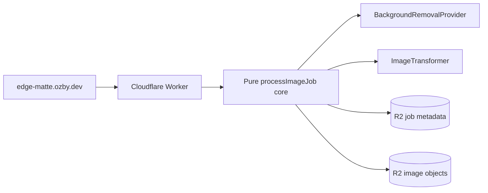

# EdgeMatte

Cloudflare-native TypeScript reference app for image matting pipelines: upload
one image, remove its background through a provider adapter, flip it at the
edge, host the result in R2, and delete every artifact with a capability token.

## Current artifacts

- [`docs/architecture.md`](./docs/architecture.md) — architecture source of truth and Mermaid charts.
- [`docs/architecture.contract.json`](./docs/architecture.contract.json) — machine-checkable architecture/blueprint drift contract.
- [`blueprints/planned/2026-05-27-edge-matte.md`](./blueprints/planned/2026-05-27-edge-matte.md) — governed implementation blueprint with architecture before/after.
- [`docs/research/2026-05-27-edge-matte-architecture-refinement.md`](./docs/research/2026-05-27-edge-matte-architecture-refinement.md) — DRY/SOLID/KISS refinement and CI/deploy rationale.
- [`docs/research/2026-05-27-cloudflare-native-image-transform-service.md`](./docs/research/2026-05-27-cloudflare-native-image-transform-service.md) — naming and platform research.
- [`docs/research/2026-05-27-image-transform-infra-best-practices.md`](./docs/research/2026-05-27-image-transform-infra-best-practices.md) — Cloudflare/Pulumi/Webpresso-aligned infra research.

## Architecture at a glance



## Governance

Architecture is enforced as a living contract:

- human-readable source: [`docs/architecture.md`](./docs/architecture.md)
- machine-readable contract: [`docs/architecture.contract.json`](./docs/architecture.contract.json)
- active blueprint linkage + before/after enforcement: [`blueprints/planned/2026-05-27-edge-matte.md`](./blueprints/planned/2026-05-27-edge-matte.md)

Current local drift check:

```bash
python3 scripts/check_architecture_drift.py
```

Target shared long-term surface across EdgeMatte, IngestLens, and sibling repos:

```bash
wp audit architecture-drift --root .
```
