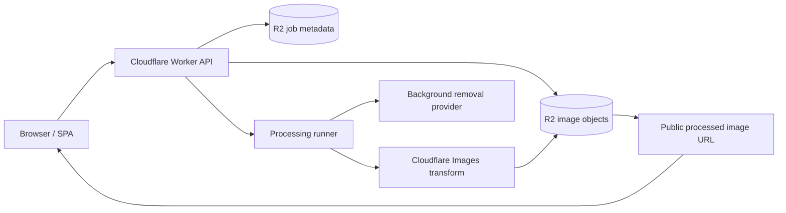

# EdgeMatte

Cloudflare-native TypeScript reference app for image matting pipelines:
upload an image, remove its background through a provider adapter, transform it at
the edge, host the result in R2, and delete every artifact through a capability
token.

This repository is being built as a public OSS project. Current contents are the
research and implementation blueprint that will drive the first vertical slice.

## Current artifacts

- [`docs/architecture.md`](./docs/architecture.md) — Mermaid architecture charts for runtime, state, storage, deployment, and queue mode.
- [`blueprints/planned/2026-05-27-edge-matte.md`](./blueprints/planned/2026-05-27-edge-matte.md) — implementation blueprint.
- [`docs/research/2026-05-27-cloudflare-native-image-transform-service.md`](./docs/research/2026-05-27-cloudflare-native-image-transform-service.md) — architecture and naming research.
- [`docs/research/2026-05-27-image-transform-infra-best-practices.md`](./docs/research/2026-05-27-image-transform-infra-best-practices.md) — Cloudflare/Pulumi/Webpresso-aligned infra research.

## Architecture at a glance

Full architecture charts: [`docs/architecture.md`](./docs/architecture.md).
