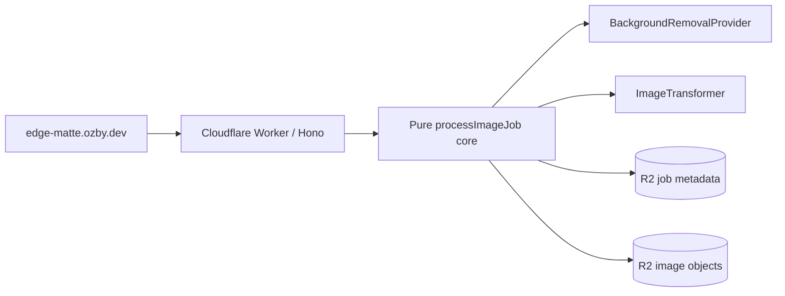

# EdgeMatte

[](./LICENSE)
[](https://github.com/ozby/edge-matte/actions/workflows/ci.webpresso.yml)

## Deployment lanes

- `main` deploys the shared preview lane: `https://preview-main.edge-matte.ozby.dev`.
- PRs deploy ephemeral `https://preview-pr-<n>.edge-matte.ozby.dev` lanes and clean up on PR close.
- Production (`https://edge-matte.ozby.dev`) is release-gated: use the production deploy workflow with matching `version_pr` metadata and a semantic `releaseVersion`; ordinary `main` pushes do not deploy production.
- Architecture source: [`docs/architecture.md`](docs/architecture.md) and machine contract [`docs/architecture.contract.json`](docs/architecture.contract.json).

## What it is

EdgeMatte is a Cloudflare-native TypeScript reference app that takes one uploaded image, removes its background at the edge, flips it horizontally, hosts the result in R2, and lets you delete every artifact with a capability token.

## Why use it

- **Production-shaped, not a toy demo** — a complete upload → process → host → delete vertical slice with storage, status, cleanup, and deploy discipline.
- **Cloudflare-native, zero external API keys** — background removal runs on the built-in `cf.image segment: "foreground"` (BiRefNet) CDN transform via a Worker sub-request.
- **Hexagonal, swap-friendly core** — a pure `processImageJob` pipeline with dependency-injected adapters, so the processing logic knows nothing about Cloudflare.

Live demo: **[edge-matte.ozby.dev](https://edge-matte.ozby.dev)** (private-beta cutover to Cloudflare Access in progress — see [`docs/release.md`](./docs/release.md#cloudflare-access-private-beta-contract)).

## Quick start

Requires Node `>=24` with `vp` (vite-plus) on `PATH`.

```bash
# Install workspace deps from the frozen lockfile
vp install --frozen-lockfile
# → pnpm@11.1.1 substrate installs all workspace deps; exits 0

# Run the no-setup mock pipeline (no Cloudflare account or secrets needed)
vp run --filter @edge-matte/worker dev:mock
# → wrangler dev boots with E2E_MOCK_PIPELINE:1 and prints a local URL;
#   the full upload → process → host → delete flow works end to end

# Run the unit + integration suites
vp run test
# → worker, client, and root suites pass green

# Run the hermetic smoke e2e suite
vp run e2e -- --suite smoke
# → wrangler dev (mock pipeline) boots; /health + SPA shell checks pass

# Run the HTTP contract e2e suite
vp run e2e -- --suite upload-delete-contract
# → upload → serve → delete plus every error code pass
```

The mock pipeline path needs no Cloudflare account, secrets, or network. (`dev:mock` is `wrangler dev --var E2E_MOCK_PIPELINE:1`; the shell-only `E2E_MOCK_PIPELINE=1` form does not propagate to Workers `env`.)

## Features

| Feature                                                                                                                                                                                 | Proof                                                                                                                                                                                                  |
| --------------------------------------------------------------------------------------------------------------------------------------------------------------------------------------- | ------------------------------------------------------------------------------------------------------------------------------------------------------------------------------------------------------ |
| Cloudflare-native background removal via `cf.image segment: "foreground"` (BiRefNet), no external API key                                                                               | [`apps/worker/src/adapters/cloudflare/cf-image-segment-provider.ts`](./apps/worker/src/adapters/cloudflare/cf-image-segment-provider.ts), [test](./apps/worker/test/cf-image-segment-provider.test.ts) |
| Pure hexagonal pipeline: validate → upload → bg-removal → flip → store → respond, DI adapters                                                                                           | [`apps/worker/src/core/process-image-job.ts`](./apps/worker/src/core/process-image-job.ts), [test](./apps/worker/test/process-image-job.test.ts)                                                       |
| Edge horizontal flip via the Workers Images binding (native, no library/upload)                                                                                                         | [`apps/worker/src/adapters/cloudflare/images-transformer.ts`](./apps/worker/src/adapters/cloudflare/images-transformer.ts)                                                                             |
| Capability-token delete: response returns a SHA-256-verified `deleteToken`; only the hash persists                                                                                      | [`apps/worker/src/core/image-job.ts`](./apps/worker/src/core/image-job.ts)                                                                                                                             |
| Result/share URL contract with shared error envelopes (`POST /api/jobs`, `GET /api/jobs/:id`, `GET /r/:id`, `GET /i/:id`, `GET /i/:id/original`, `DELETE /api/jobs/:id`, `GET /health`) | [`apps/worker/src/adapters/hono/app.ts`](./apps/worker/src/adapters/hono/app.ts), [routes test](./apps/worker/test/routes.test.ts)                                                                     |
| R2-backed storage for both image bytes and job metadata                                                                                                                                 | [`r2-image-object-store.ts`](./apps/worker/src/adapters/cloudflare/r2-image-object-store.ts), [`r2-job-repository.ts`](./apps/worker/src/adapters/cloudflare/r2-job-repository.ts)                     |
| PNG matte edge-cleanup post-processing                                                                                                                                                  | [`apps/worker/src/adapters/cloudflare/png-matte-edge-cleaner.ts`](./apps/worker/src/adapters/cloudflare/png-matte-edge-cleaner.ts), [test](./apps/worker/test/png-matte-edge-cleaner.test.ts)          |
| Framework-free 8-phase client UI state machine                                                                                                                                          | [`apps/client/src/state.ts`](./apps/client/src/state.ts), [test](./apps/client/test/state.test.ts)                                                                                                     |
| Abuse / security guarding on the worker                                                                                                                                                 | [abuse-guard test](./apps/worker/test/abuse-guard.test.ts), [security test](./apps/worker/test/security-and-assets.test.ts)                                                                            |
| Hermetic + production e2e suites (smoke, upload-delete, upload-delete-contract, production-smoke, production-journey)                                                                   | [`apps/e2e/src/e2e-suite-manifest.ts`](./apps/e2e/src/e2e-suite-manifest.ts), [`apps/e2e/src/cli/run-e2e.ts`](./apps/e2e/src/cli/run-e2e.ts)                                                           |
| Cloudflare Access private-beta service-token contract                                                                                                                                   | [`apps/e2e/src/journeys/access.test.ts`](./apps/e2e/src/journeys/access.test.ts), [`docs/release.md`](./docs/release.md)                                                                               |
| CI: quality pipeline + architecture-drift gate + custom-domain previews (`preview-main.edge-matte.ozby.dev`, `preview-pr-<n>.edge-matte.ozby.dev`) + release-gated production deploy    | [`ci.webpresso.yml`](./.github/workflows/ci.webpresso.yml), [`deploy.preview.yml`](./.github/workflows/deploy.preview.yml), [`deploy.production.yml`](./.github/workflows/deploy.production.yml)       |
| Machine-checkable architecture drift contract via `wp audit architecture-drift`                                                                                                         | [`docs/architecture.contract.json`](./docs/architecture.contract.json), [`docs/architecture.md`](./docs/architecture.md)                                                                               |
| Pulumi-managed Cloudflare infrastructure with a Wrangler deploy split                                                                                                                   | [`scripts/deploy-production.ts`](./scripts/deploy-production.ts), [`scripts/verify-deploy-contract.ts`](./scripts/verify-deploy-contract.ts), [`docs/release.md`](./docs/release.md)                   |

## Architecture



Hono routes inside one Worker; the pure core is dependency-injected with the `cf.image segment` provider, the Workers Images flip, and R2 storage. Tests swap those ports for in-memory mocks. Full source-of-truth diagrams live in [`docs/architecture.md`](./docs/architecture.md).

## Verify

**Fast contributor check** — hermetic, no secrets, no network:

```bash
vp install --frozen-lockfile
vp run -r lint
vp run -r check-types
vp run test
vp run e2e -- --suite smoke
```

**Full maintainer check (maintainer only)** — includes mutation testing, the architecture-drift gate, and production e2e against the deployed URL:

```bash
vp run qa                               # wp lint + typecheck + vitest + mutation + playwright e2e
wp audit architecture-drift --root .
E2E_RUN_PRODUCTION=1 vp run e2e -- --suite production-smoke
E2E_RUN_PRODUCTION=1 vp run e2e -- --suite production-journey
```

`production-journey` is the only suite that proves the real background-removal + flip transform; the hermetic suites prove plumbing, the API contract, and the browser UI.

## Contribute / Security / License

- [`CONTRIBUTING.md`](./CONTRIBUTING.md) — setup, verify commands, commit/PR conventions.
- [`SECURITY.md`](./SECURITY.md) — how to report a vulnerability privately.
- [`CODE_OF_CONDUCT.md`](./CODE_OF_CONDUCT.md) — Contributor Covenant.
- [`LICENSE`](./LICENSE) — MIT.
- [`VISION.md`](./VISION.md) — product north star and scope boundaries.
