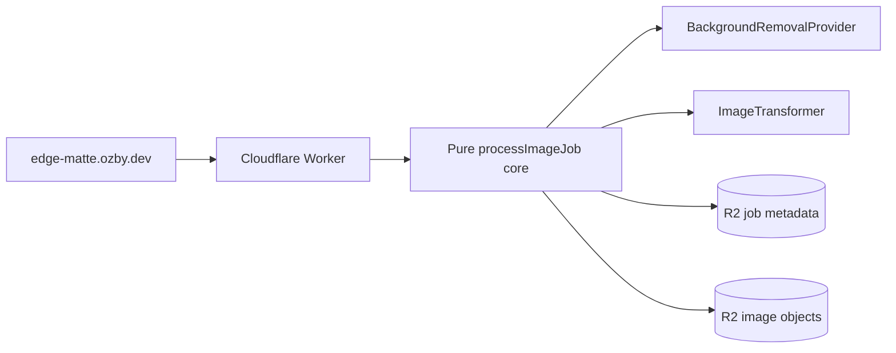

# EdgeMatte

Cloudflare-native TypeScript reference app for image matting pipelines: upload
one image, remove its background through a provider adapter, flip it at the
edge, host the result in R2, and delete every artifact with a capability token.

## Current artifacts

- [`docs/architecture.md`](./docs/architecture.md) — architecture source of truth and Mermaid charts.
- [`docs/architecture.contract.json`](./docs/architecture.contract.json) — machine-checkable architecture/blueprint drift contract.
- [`docs/release.md`](./docs/release.md) — release/deploy path, Pulumi/Wrangler ownership, post-deploy smoke.
- [`docs/secrets.md`](./docs/secrets.md) — secret ownership (GitHub vs Cloudflare vs Doppler).
- [`blueprints/completed/2026-05-27-edge-matte.md`](./blueprints/completed/2026-05-27-edge-matte.md) — governed implementation blueprint with architecture before/after.
- [`docs/research/2026-05-27-edge-matte-architecture-refinement.md`](./docs/research/2026-05-27-edge-matte-architecture-refinement.md) — DRY/SOLID/KISS refinement and CI/deploy rationale.
- [`docs/research/2026-05-27-cloudflare-native-image-transform-service.md`](./docs/research/2026-05-27-cloudflare-native-image-transform-service.md) — naming and platform research.
- [`docs/research/2026-05-27-image-transform-infra-best-practices.md`](./docs/research/2026-05-27-image-transform-infra-best-practices.md) — Cloudflare/Pulumi/Webpresso-aligned infra research.

## Architecture at a glance



## Governance

Architecture is enforced as a living contract:

- human-readable source: [`docs/architecture.md`](./docs/architecture.md)
- machine-readable contract: [`docs/architecture.contract.json`](./docs/architecture.contract.json)
- active blueprint linkage + before/after enforcement: [`blueprints/completed/2026-05-27-edge-matte.md`](./blueprints/completed/2026-05-27-edge-matte.md)

Current local drift check:

```bash
python3 scripts/check_architecture_drift.py
```

## Release and deploy

Production target: `https://edge-matte.ozby.dev`.

- [`docs/release.md`](./docs/release.md) — Pulumi/Wrangler ownership split, CI deploy path, post-deploy smoke, maintainer bootstrap
- [`docs/secrets.md`](./docs/secrets.md) — GitHub vs Cloudflare vs Doppler secret ownership (provider keys in Cloudflare, not GitHub)

Quick verification after deploy:

```bash
curl -sf https://edge-matte.ozby.dev/health
E2E_RUN_PRODUCTION=1 pnpm e2e -- --suite production-smoke
```

## Local bootstrap surface

This repo includes starter project files for TypeScript/Workers development:

- `tsconfig.json` and `wrangler.toml` for TypeScript/Workers compatibility
- `pnpm-workspace.yaml` for monorepo package layout
- `apps/client` and `apps/worker` shells for the EdgeMatte runtime
- `package.json` for local onboarding (public deps only — no repo-local `@webpresso/*` packages)

### Webpresso tooling (`wp` and `vp`)

EdgeMatte reuses the same **quality and governance rails** as IngestLens instead of
inventing parallel lint hooks, blueprint checks, or commit conventions. That work
is handled by global CLI tools on your `PATH`, not by npm dependencies in this repo.

| Tool     | Role                       | What it solves                                                                                                                                                                                                                                                     |
| -------- | -------------------------- | ------------------------------------------------------------------------------------------------------------------------------------------------------------------------------------------------------------------------------------------------------------------ |
| **`wp`** | Webpresso / agent-kit CLI  | Scaffolds `.agent/` surfaces, runs **audits** (commit-message lore protocol, blueprint lifecycle, docs frontmatter, guardrails, architecture drift), wires IDE/agent hooks, and keeps repo policy enforceable in CI and pre-commit without custom one-off scripts. |
| **`vp`** | vite-plus workspace runner | Runs package scripts across the pnpm workspace (`vp install`, `vp run test`, `vp check`, `vp fmt`) so verification commands stay consistent across apps without duplicating script wiring in every package.                                                        |

Install `@webpresso/agent-kit` globally (or use a sibling Webpresso checkout with `wp`/`vp` on `PATH`). This repo does **not** pin `@webpresso/agent-kit` in `devDependencies` — reviewers can `pnpm install` without GitHub Packages tokens; maintainers install `wp`/`vp` once on their machine (and CI must provide `wp` for audit jobs).

Verify bootstrap posture with:

```bash
vp install
wp config secrets set doppler edge-matte
wp init --dry-run
vp run -r build
vp run -r lint
vp run -r check-types
pnpm run test
pnpm e2e -- --suite smoke
pnpm e2e -- --suite upload-delete
E2E_RUN_PRODUCTION=1 pnpm e2e -- --suite production-smoke
vp run verify:secrets
vp run audit:secret-provider-quarantine
python3 scripts/check_architecture_drift.py
WP_SKIP_UPDATE_CHECK=1 wp audit guardrails
```

Target shared long-term surface across EdgeMatte, IngestLens, and sibling repos:

```bash
wp audit architecture-drift --root .
```
