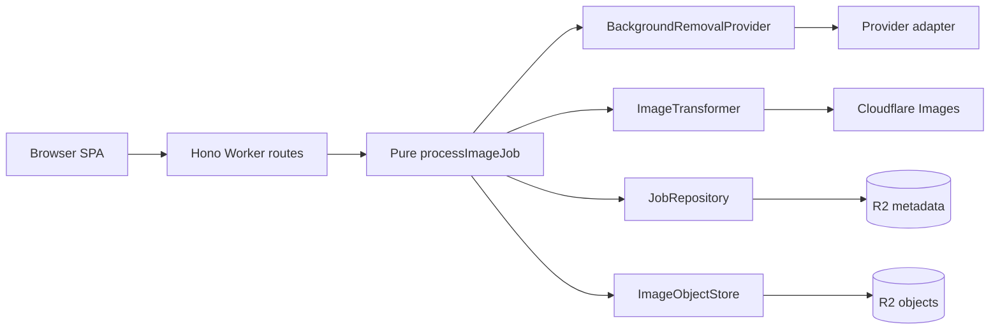

# EdgeMatte: Cloudflare-native image matting platform

## Decision

Build **EdgeMatte** as a public, company-neutral OSS app and reference
implementation for Cloudflare-native image cutout pipelines.

The selected shape is a **thin full edge pipeline slice**: one polished upload
flow and one production-minded backend path, with platform seams that can grow
without forcing a v1 queue/database platform.

Guardrail: v1 runs image processing inline. Cloudflare Queue execution is a
promotion path only after the inline path is green and deployed.

## Architecture governance

Architecture docs:

- [`docs/architecture.md`](../../docs/architecture.md)
- [`docs/architecture.contract.json`](../../docs/architecture.contract.json)

Every active blueprint must stay aligned with those files. Architecture-changing
blueprints must record an explicit before/after delta.

## Architecture before

Before this refinement, the plan was close but still carried too much implied
platform complexity: queue mode was documented too close to the v1 path,
quality/e2e reuse from agent-kit was not explicit enough, and architecture
governance was not codified.

## Architecture after

The governed v1 architecture is one Worker, Workers Static Assets, one R2
bucket, one pure pipeline core, explicit ports/adapters, agent-kit/vite-plus
quality reuse, and `edge-matte.ozby.dev` as the production contract. Queue mode
remains a promotion path only.

## Objective

Ship a live app at `https://edge-matte.ozby.dev` that lets a user upload one
image, creates a job, removes the background through a provider adapter, flips
the result horizontally, hosts the processed image online, exposes safe job
status, and deletes every stored artifact with a capability token.

Recommended public identity:

- **Project name:** EdgeMatte
- **Repository:** `edge-matte`
- **Package/app slug:** `edge-matte`
- **One-line OSS positioning:** Cloudflare-native TypeScript reference app for
  image cutout pipelines: upload, background removal, edge transform, R2
  hosting, job status, and capability-based deletion.

## Principal requirement traceability to `task.pdf`

This blueprint is the principal-level interpretation layer for `task.pdf`. If
optional polish ever conflicts with the take-home brief, the brief wins.

| `task.pdf` requirement | EdgeMatte contract |
|---|---|
| Upload a single image file | One-file upload UI and `POST /api/jobs` multipart API. |
| Remove the background using a third-party service | `PhotoroomBackgroundRemovalProvider` behind the `BackgroundRemovalProvider` port. |
| Horizontally flip after background removal | `CloudflareImagesTransformer` uses the Workers Images binding to apply `flip=h` after cutout. |
| Host the processed image online and return a unique URL | The processed artifact is stored in R2 and served at `https://edge-matte.ozby.dev/i/:id`. |
| Allow deletion of uploaded and processed images | `DELETE /api/jobs/:id` deletes original object, processed object, and metadata using the capability delete token. |
| Backend must be TypeScript | Worker/core/adapters are TypeScript. |
| Frontend + backend deployed online | Worker + static assets deploy together to `edge-matte.ozby.dev`. |
| Source shared via GitHub repository | `review_target: public GitHub repository` remains the release target. |

Pinpoint interpretation note: the blueprint intentionally does **not** expand
the assignment into auth, batch jobs, dashboards, or queue-first architecture.
Those are explicitly out of scope unless implementation evidence later forces a
small promotion.

## Success criteria

- Live production URL: `https://edge-matte.ozby.dev`.
- Upload flow handles exactly one PNG/JPEG/WebP image under 8 MiB.
- UI shows client validation, preview, loading/progress, success, recoverable
  errors, result URL, download, and delete confirmation.
- Backend is TypeScript on Cloudflare Workers with Hono route adapters.
- Background removal uses one production provider behind a port and a mock
  provider in tests.
- Processed result is horizontally flipped **after** background removal via the
  Cloudflare Images Workers binding.
- Result is hosted at a unique URL served from R2 through the Worker.
- `GET /api/jobs/:id` returns only safe public status fields.
- Delete action removes original object, processed object, and job metadata.
- Public artifacts are company-neutral and do not expose private brief language.
- README includes setup, architecture, live demo URL, provider setup, and
  verification commands.
- From a clean clone, a maintainer can follow README bootstrap steps and run the
  local full flow (upload -> ready -> delete) without hidden/manual side paths.
- CI uses agent-kit/vite-plus gates, deploy dry-run on PRs, and Wrangler deploy
  to `edge-matte.ozby.dev` on `main`.
- E2E uses the agent-kit host-adapter/suite-manifest pattern; no bespoke QA
  harness when agent-kit already owns the lane.

## Delivery contract: TDD + E2E required

This plan is not implementation-ready unless every child blueprint follows:

1. **Red:** write the failing test first for the next behavior slice.
2. **Green:** implement the minimum code to pass.
3. **Refactor:** clean up while keeping tests green.

No production behavior is considered complete without:

- targeted failing-then-passing unit/integration coverage for the changed slice;
- feature-level contract coverage in E2E through HTTP/browser, not internal API calls;
- no mock-only confidence for the primary user journey.

For this repo, “done” means the user-facing flow remains covered end-to-end:

- upload one image;
- wait for processing;
- receive hosted result URL;
- open the hosted image;
- delete artifacts;
- confirm the hosted image is no longer available.

## Reuse decisions

| Existing pattern | EdgeMatte decision |
|---|---|
| Webpresso vision | Reuse evidence-first readiness, explicit failure modes, rollback/recovery language. |
| IngestLens repo structure | Reuse reviewer-friendly README, apps split, Cloudflare Worker organization, and docs/blueprint lifecycle. |
| IngestLens quality surface | Reuse `vp` scripts, `wp` audits/setup, agent-kit Vitest presets, and `ak_*` lanes. |
| IngestLens e2e surface | Reuse `agent-kit.config.ts` host adapter, `apps/e2e` suite manifest, suite/file resolution, and Playwright/Vitest runner split. |
| IngestLens infra boundary | Pulumi owns durable resources; Wrangler owns Worker deployment, routes, bindings, and secret names. |
| Webpresso runtime discipline | Use deadline-bounded provider fetches, structured validation, and explicit error taxonomy. |

Public-install caveat: keep **app runtime** independent of private/internal packages.
`pnpm install` in this repo resolves only public workspace deps (TypeScript, Husky, etc.).

**Quality/governance tooling** uses global `wp` and `vp` on `PATH` — commit hooks,
blueprint audits, docs checks, and structured agent lanes — documented in README.
Do not re-add `@webpresso/agent-kit` as a repo-local dependency just for the CLI.

When Vitest/E2E lanes ship, preset **imports** (e.g. `@webpresso/agent-kit/vitest/workers`)
may still need thin, scoped devDependencies or a global agent-kit install that exposes
those subpaths; that is separate from the global-`wp` CLI decision.

## Not in scope

- User accounts or auth; the delete token is the v1 capability.
- Multi-image batch uploads.
- Provider marketplace; one production provider and one mock provider are enough.
- Database metadata; R2 `jobs/{id}.json` is the job source of truth.
- Batch dashboard or admin UI.
- WASM image processing unless Cloudflare Images transformation is blocked.
- Queue-first architecture; queues are conditional promotion only.
- Billing/credit tracking; provider quota caveats belong in docs.

## Architecture

The elegant v1 architecture is:

```text
edge-matte.ozby.dev
  -> Cloudflare Worker + Workers Static Assets
  -> Hono route adapter
  -> pure processImageJob(command, deps)
  -> BackgroundRemovalProvider port
  -> ImageTransformer port
  -> JobRepository / ImageObjectStore ports
  -> Photoroom + Cloudflare Images + R2 adapters
```



Design principle: routes parse HTTP, the core orchestrates domain state, adapters
perform side effects. This is enough structure for DRY/SOLID without adding a
framework inside the framework.

Full charts: [`docs/architecture.md`](../../docs/architecture.md). Drift contract: [`docs/architecture.contract.json`](../../docs/architecture.contract.json).

## Domain model

```ts
type ImageJobStatus =
  | "validating"
  | "uploading"
  | "removing_background"
  | "flipping"
  | "ready"
  | "deleted"
  | "failed";

type ImageJob = {
  id: string;
  originalKey: string;
  processedKey: string;
  metadataKey: string;
  originalContentType: "image/png" | "image/jpeg" | "image/webp";
  processedContentType: "image/png" | "image/webp";
  provider: "photoroom";
  createdAt: string;
  updatedAt: string;
  deleteTokenHash: string;
  status: ImageJobStatus;
  errorCode?: string;
};

type PublicJobResponse = {
  id: string;
  status: ImageJobStatus;
  imageUrl: string | null;
  createdAt: string;
  updatedAt: string;
  errorCode?: string;
};
```

## Ports and adapters

```ts
interface BackgroundRemovalProvider {
  removeBackground(input: File, signal: AbortSignal): Promise<Blob>;
}

interface ImageTransformer {
  flipHorizontal(input: ReadableStream, output: "image/png" | "image/webp"): Promise<Response>;
}

interface JobRepository {
  create(job: ImageJob): Promise<void>;
  update(job: ImageJob): Promise<void>;
  get(id: string): Promise<ImageJob | null>;
  delete(id: string): Promise<void>;
}

interface ImageObjectStore {
  putOriginal(job: ImageJob, file: File): Promise<void>;
  putProcessed(job: ImageJob, body: ReadableStream | ArrayBuffer, contentType: string): Promise<void>;
  getProcessed(id: string): Promise<Response | null>;
  deleteAll(job: ImageJob): Promise<void>;
}
```

One runner owns the sequence:

```text
validate -> create job -> store original -> status removing_background
  -> provider cutout -> status flipping -> edge transform
  -> store processed -> status ready
  └──────── cleanup + status failed on unrecoverable failure ───────┘
```

## API contract

### `POST /api/jobs`

Request:

- `multipart/form-data`
- `image`: exactly one file

Validation:

- max size: 8 MiB;
- supported MIME: `image/png`, `image/jpeg`, `image/webp`;
- verify magic bytes, not MIME alone;
- reject missing or multiple files.

Inline-mode response `201`:

```json
{
  "id": "job_...",
  "status": "ready",
  "imageUrl": "https://edge-matte.ozby.dev/i/job_...",
  "deleteToken": "del_...",
  "pollUrl": "https://edge-matte.ozby.dev/api/jobs/job_..."
}
```

Errors:

- `400 invalid_upload`
- `413 file_too_large`
- `415 unsupported_media_type`
- `502 background_provider_failed`
- `502 image_transform_failed`
- `500 storage_failed`

### `GET /api/jobs/:id`

Returns only public job status. Never return object keys, token hashes, provider
payloads, stack traces, or secrets.

### `GET /i/:id`

Streams the processed image from R2 with `Content-Type`, long-lived immutable
cache headers, and `ETag` when available. Returns `404` until ready and after
deletion.

### `DELETE /api/jobs/:id`

Request:

```json
{ "deleteToken": "del_..." }
```

Behavior:

- hash token with Web Crypto SHA-256;
- compare to `job.deleteTokenHash`;
- delete original, processed, and metadata keys;
- return `204`.

## Implementation gap map

The architecture is now clear, but implementation is still missing in four
concrete areas. These child blueprints split execution so the repo can be built
in clean vertical slices:

1. [`2026-05-27-edge-matte-workspace-scaffold.md`](./2026-05-27-edge-matte-workspace-scaffold.md)
2. [`2026-05-27-edge-matte-core-pipeline.md`](./2026-05-27-edge-matte-core-pipeline.md)
3. [`2026-05-27-edge-matte-ui-and-e2e.md`](./2026-05-27-edge-matte-ui-and-e2e.md)
4. [`2026-05-27-edge-matte-infra-and-release.md`](./2026-05-27-edge-matte-infra-and-release.md)

These are implementation blueprints, not architecture rewrites. They exist to
close the current gaps between the documented design and a deployable public
repo. Execute them in order: scaffold -> core pipeline -> UI/E2E -> infra/release.

## Ship-order execution checklist

### 1. `2026-05-27-edge-matte-workspace-scaffold`

Start when:

- repo topology can still change safely;
- no backend/UI feature work has started.

Must finish before next blueprint starts:

- workspace install/build/lint/typecheck/test commands exist;
- Worker/client/E2E directories and config surfaces exist;
- Wrangler/TypeScript/agent-kit/vite-plus wiring is on disk;
- architecture drift check passes.

Hard stop condition:

- do not start core pipeline work until no further repo-topology changes are
  needed to support Worker, client, E2E, and release paths.

### 2. `2026-05-27-edge-matte-core-pipeline`

Start when:

- scaffold blueprint is green;
- failing backend tests can be added against stable file locations.

Must finish before next blueprint starts:

- upload/status/image/delete/health routes exist;
- processing order is exact: upload -> remove background -> flip -> host;
- safe public responses and delete-token behavior are implemented;
- mock-backed backend path works end-to-end;
- `upload-delete` contract suite is able to target the backend path.

Hard stop condition:

- do not start UI polish work until the backend contract is stable enough that
  the client can bind to real route shapes without speculative rework.

### 3. `2026-05-27-edge-matte-ui-and-e2e`

Start when:

- backend contract is stable;
- mock or real backend path can drive the visible journey.

Must finish before next blueprint starts:

- reviewer can upload one image, wait, receive hosted URL, open result, and delete;
- `smoke` and `upload-delete` pass through browser/public HTTP surfaces;
- client states cover loading, success, recoverable error, and delete flows;
- README/local run path is demonstrable from a clean clone.

Hard stop condition:

- do not start production release work until the local reviewer-visible journey
  is passing and E2E contract coverage is green.

### 4. `2026-05-27-edge-matte-infra-and-release`

Start when:

- local app flow is demonstrable;
- required bindings/secrets/resource names are known.

Must finish before ship:

- R2/Pulumi/Wrangler ownership is codified;
- PR CI proves quality + dry-run deploy;
- `main` deploy path targets `edge-matte.ozby.dev`;
- post-deploy `production-smoke` passes;
- release/setup docs cover secret ownership and bootstrap.

Hard stop condition:

- do not declare the assignment shipped until `https://edge-matte.ozby.dev`
  is live and `production-smoke` is green.

## Parallel execution plan

Use the blueprints as the top-level serial chain:

1. workspace scaffold
2. core pipeline
3. UI + E2E
4. infra + release

Within each blueprint, parallelism is allowed only inside a wave after its
dependencies are green.

### Cross-blueprint dependency graph

| Blueprint | Depends on | Unblocks |
|---|---|---|
| workspace scaffold | none | core pipeline, UI + E2E, infra + release |
| core pipeline | workspace scaffold | UI + E2E, infra + release |
| UI + E2E | workspace scaffold, core pipeline | infra + release |
| infra + release | workspace scaffold, core pipeline, UI + E2E | ship |

### Parallel lane rules

- Prefer the smallest number of parallel lanes that keeps independent file
  surfaces busy.
- Do not run two agents against the same write scope in the same wave.
- Test-heavy or deploy-heavy waves should stay conservative.
- A failed task blocks its dependents; do not “work around” the dependency graph.

### File-conflict boundaries

| Lane family | Primary write scope |
|---|---|
| scaffold/root | root config files, docs/bootstrap, shared config |
| worker/core | `apps/worker/**` |
| client/ui | `apps/client/**` |
| e2e | `apps/e2e/**`, `agent-kit.config.ts`, runner wiring |
| infra/release | `infra/**`, `.github/workflows/**`, `wrangler.toml`, release docs |

If a task needs more than one lane family, treat it as a merge/verification task
and schedule it after the independent lanes complete.

## Quality DRY contract

Root scripts should follow the IngestLens/Webpresso shape:

```jsonc
{
  "scripts": {
    "build": "vp run build",
    "check": "vp check",
    "format": "vp fmt",
    "format:check": "vp fmt --check",
    "lint": "vp run lint",
    "test": "vp run test",
    "check-types": "vp run check-types",
    "setup:agent": "wp setup",
    "postinstall": "WP_SKIP_GSTACK=1 WP_SKIP_UPDATE_CHECK=1 wp setup --yes --overwrite",
    "docs:check": "WP_SKIP_UPDATE_CHECK=1 wp audit docs-frontmatter",
    "blueprints:check": "WP_SKIP_UPDATE_CHECK=1 wp audit blueprint-lifecycle --legacy-omx",
    "e2e": "bun ./apps/e2e/src/cli/run-e2e.ts"
  }
}
```

Test config reuse:

- Worker tests import `workersConfig` from `@webpresso/agent-kit/vitest/workers`.
- Client tests import `reactConfig` from `@webpresso/agent-kit/vitest/react`.
- Infra/node tests import `nodeConfig` from `@webpresso/agent-kit/vitest/node`.
- Configs merge with `mergeConfig` from `vite-plus/test/config`.
- Normal verification prefers `ak_test`, `ak_typecheck`, `ak_lint`, and `ak_qa`
  when those structured lanes are available.

CLI vs preset packages: global `wp`/`vp` cover audits, setup, hooks, and workspace
script routing. Vitest preset subpath imports above are resolved when test configs
land (via global agent-kit on PATH or optional scoped devDeps) — not by pinning the
full agent-kit CLI in root `package.json`.

Do not create local wrappers that duplicate `vp`, `wp`, `ak_*`, or agent-kit
Vitest presets.

## E2E DRY contract

Adopt the IngestLens agent-kit pattern:

```ts
// agent-kit.config.ts
export const agentKitConfig = {
  e2e: {
    hostAdapterModule: "./apps/e2e/src/agent-kit-host-adapter.ts",
  },
} as const;

export default agentKitConfig;
```

`apps/e2e` owns only project-specific journeys and suite registration:

```text
apps/e2e/
  journeys/
    smoke.e2e.ts              # /health and app shell
    upload-delete.e2e.ts      # mock provider: upload -> ready -> image -> delete -> 404
    production-smoke.spec.ts  # edge-matte.ozby.dev read-only smoke
  src/
    e2e-suite-manifest.ts     # suite ids, aliases, file matchers, steps
    agent-kit-host-adapter.ts # list/resolve/buildExecutionPlan for agent-kit
    cli/run-e2e.ts            # thin command that dispatches manifest steps
  playwright.config.ts        # uses agent-kit e2e preset + E2E_CLIENT_URL
```

Suites:

| Suite | Runner | Purpose | CI use |
|---|---|---|---|
| `smoke` | Vitest or Playwright | `/health` and SPA shell boot | PR + main |
| `upload-delete` | Playwright | mock provider full user flow | PR |
| `production-smoke` | Playwright | `edge-matte.ozby.dev` read-only canary | post-deploy |
| `full` | mixed | all non-destructive journeys | pre-release/manual |

The local e2e runner may start `wrangler dev` on random ports and inject mock
provider vars, but orchestration must stay small and generated from the suite
manifest. Do not fork a second QA framework; expose suites through agent-kit so
`ak_qa` can choose targeted runs by suite or file.

## Implementation tasks

### Phase 1 — Public repo shell and docs

- [ ] Write failing scaffold/tests first for workspace scripts, package topology, and E2E manifest resolution before adding implementation files.
- [ ] Add `LICENSE`, `package.json`, `tsconfig.json`, app packages, Cloudflare config, and CI workflow.
- [ ] Add README with live URL, setup, secrets, architecture, trade-offs, and verification commands.
- [ ] Add secret onboarding docs (no `.dev.vars*` or `.env*` files except `.env.example`): document required worker secret names and local setup path.
- [ ] Add `agent-kit.config.ts` and root scripts that route quality/e2e through agent-kit/vite-plus.

### Phase 2 — Cloudflare Worker API

- [ ] Write failing Worker/route tests first for upload, status, image read, delete, and health.
- [ ] Build Hono routes for upload, status, image read, delete, and health.
- [ ] Add Hono `bodyLimit`, multipart parsing, MIME/magic-byte validation, and typed errors.
- [ ] Generate Worker types with `wrangler types`.
- [ ] Keep assets and API same-origin under `edge-matte.ozby.dev`.

### Phase 3 — Core pipeline and adapters

- [ ] Write failing core/integration tests first for `ImageJob`, key derivation, status transitions, and delete-token hashing.
- [ ] Implement `ImageJob`, key derivation, status transitions, and delete-token hashing.
- [ ] Implement R2-backed `JobRepository` and `ImageObjectStore`.
- [ ] Implement `processImageJob()` orchestration.
- [ ] Implement `PhotoroomBackgroundRemovalProvider` and mock provider.
- [ ] Implement `CloudflareImagesTransformer` and mock transformer using the
      Workers Images binding (`env.IMAGES.input(...).transform({ flip: "h" })`).
- [ ] Ensure partial failures update status and cleanup safe orphaned objects.
- [ ] Keep queue adapter out of v1 unless inline deploy is already green.

### Phase 4 — UI

- [ ] Write failing client and browser-journey tests first for upload, progress, result, copy URL, and delete UX.
- [ ] Build polished single-page upload UI.
- [ ] Add preview, validation, status timeline, result preview, copy URL, download, delete confirmation, and retry/error recovery.
- [ ] Keep UI company-neutral and OSS-oriented.

### Phase 5 — Infra and deployment

- [ ] Write failing verification for deploy/dry-run/smoke workflow expectations before finalizing release automation.
- [ ] Add Pulumi project for `edge-matte-production-images` R2 bucket and lifecycle cleanup.
- [ ] Keep Worker routes, assets, bindings, and secret names in Wrangler config.
- [ ] Configure production route as `edge-matte.ozby.dev` with `custom_domain = true`.
- [ ] Add deploy instructions for Cloudflare deploy secrets and provider Worker secret.

### Phase 6 — Verification and E2E

- [ ] Unit test validation, token hashing, key derivation, state transitions, and cleanup.
- [ ] Hono route tests with mocked provider/store using `app.request()`.
- [ ] Workers-pool tests for R2 binding behavior where practical.
- [ ] React/jsdom tests for client state transitions.
- [ ] Agent-kit e2e suites: `smoke`, `upload-delete`, `production-smoke`, `full`.
- [ ] Manual smoke on deployed URL: upload -> ready -> image loads -> delete -> 404.

## Test contract by feature

| Feature | Red/green test-first requirement | E2E contract |
|---|---|---|
| Upload validation | failing route/integration tests for missing file, multiple files, unsupported type, spoofed bytes, oversize | `upload-delete` covers real browser upload rejection/success path |
| Background removal + flip | failing core/route tests for exact state progression and safe error codes | `upload-delete` verifies final artifact is reachable only after processing completes |
| Hosted image URL | failing route tests for `GET /i/:id` ready/not-ready/deleted cases | `upload-delete` and `production-smoke` open the returned URL through HTTP/browser |
| Delete capability | failing core/route tests for valid token, invalid token, missing job | `upload-delete` deletes through UX then confirms image URL returns 404 |
| Production readiness | failing smoke expectations for health/app shell/release path | `production-smoke` is required post-deploy contract coverage |

E2E rule: the contract suites must exercise the system through browser actions
and HTTP requests only. They must not “pass” by importing internal Worker/core
modules or bypassing the public route/UI surfaces.

## Test strategy by blueprint

| Blueprint | Unit focus | Integration focus | Confidence gate |
|---|---|---|---|
| Workspace scaffold | config helpers, script resolution, secret-doc guards | bootstrap/config/audit wiring | next blueprint cannot require topology rework |
| Core pipeline | domain model, validators, key derivation, redaction helpers | orchestration, routes, R2/store behavior, failure cleanup | backend contract stable enough for real client binding |
| UI + E2E | state transitions, UI helpers, component behavior | jsdom UI flow, client/API boundary, suite discovery | visible journey passes locally and contract E2E is green |
| Infra + release | deploy/config helpers, workflow logic | CI/workflow/config/deploy smoke | production URL live and `production-smoke` green |

## Coverage map

```text
CODE PATHS                                             USER FLOWS
[+] POST /api/jobs                                     [+] Upload happy path
  ├── valid PNG/JPEG/WebP                                ├── preview before submit
  ├── missing file                                       ├── status timeline during provider call
  ├── multiple files                                     ├── result preview after processing
  ├── unsupported MIME                                   └── copy/download URL
  ├── MIME spoof / bad magic bytes
  ├── file > 8 MiB                                     [+] Status flow
  ├── provider success                                   ├── processing/ready states
  ├── provider timeout/failure                           ├── failed state with safe error
  ├── transform success                                  └── deleted job returns gone
  ├── transform failure
  └── cleanup on partial failure                       [+] Delete flow
                                                           ├── confirmation before delete
[+] GET /api/jobs/:id                                    ├── success clears UI state
  ├── job exists/status public                           └── second delete shows gone
  ├── failed job redacts internals
  └── deleted job returns 404                          [+] Error states
                                                           ├── validation error
[+] GET /i/:id                                            ├── provider unavailable
  ├── processed exists                                    ├── transform unavailable
  └── deleted/missing image                               └── network retry

[+] DELETE /api/jobs/:id
  ├── valid token deletes all keys
  ├── invalid token returns 401
  ├── missing record returns 404
  └── partial delete failure reports 500
```

## Verification commands

Preferred local commands:

```bash
vp install
vp run format:check
vp run lint
vp run check-types
vp run test
vp run build
vp run docs:check
vp run blueprints:check
vp run e2e -- --suite smoke
vp run e2e -- --suite upload-delete
vp run deploy:dry-run
```

TDD rule for execution:

```text
For every implementation slice:
1. Run the targeted test and watch it fail.
2. Implement minimum code.
3. Re-run the same targeted test and watch it pass.
4. Re-run broader affected suites, including the relevant E2E contract suite.
```

Preferred agent lanes when available:

```text
ak_test        # tests
ak_typecheck   # typecheck
ak_lint        # lint
ak_qa          # targeted/full QA, including e2e suites through host adapter
ak_audit       # docs/blueprint lifecycle checks
```

Post-deploy smoke:

```text
1. Open https://edge-matte.ozby.dev.
2. Confirm /health returns OK.
3. Run production-smoke e2e against https://edge-matte.ozby.dev.
4. Manually upload PNG/JPEG/WebP under 8 MiB.
5. Confirm job reaches ready and returned image is background-removed + flipped.
6. Open returned image URL in a new tab.
7. Delete from UI.
8. Reload image URL and confirm 404.
```

## CI/CD plan

PR/push CI:

```text
checkout
-> setup Node + package cache
-> vp install --frozen-lockfile
-> vp run format:check
-> vp run lint
-> vp run check-types
-> vp run test
-> vp run e2e -- --suite smoke
-> vp run e2e -- --suite upload-delete
-> vp run build
-> vp run docs:check
-> vp run blueprints:check
-> wrangler deploy --dry-run
```

Production deploy on `main`:

```text
CI gates
-> cloudflare/wrangler-action@v3 deploy --env production
-> GitHub environment: production
-> environment URL: https://edge-matte.ozby.dev
-> vp run e2e -- --suite production-smoke
-> curl -fsS https://edge-matte.ozby.dev/health
```

Secrets:

- GitHub secrets: `CLOUDFLARE_API_TOKEN`, `CLOUDFLARE_ACCOUNT_ID`.
- Cloudflare Worker secret: `PHOTOROOM_API_KEY` via `wrangler secret put PHOTOROOM_API_KEY --env production`.
- Keep provider secret values in Cloudflare (secret provider), not in GitHub or
  on-disk files (`.dev.vars*` / `.env*`, except `.env.example`).

## 6-hour execution plan

| Time | Work |
|---|---|
| 0:00-0:30 | Scaffold repo, package scripts, agent-kit config, Cloudflare config, README skeleton. |
| 0:30-1:30 | Job model, validation, R2 repositories/stores, token hashing. |
| 1:30-2:30 | Provider adapter, transform adapter, pure pipeline core, status transitions. |
| 2:30-3:30 | Hono routes, typed errors, health route, route tests. |
| 3:30-4:30 | Polished UI with status timeline and result/delete flows. |
| 4:30-5:15 | Unit/route/worker/client tests plus agent-kit e2e smoke/upload-delete. |
| 5:15-5:45 | Production deploy to `edge-matte.ozby.dev` and production-smoke e2e. |
| 5:45-6:00 | README final pass, architecture docs, known caveats. |

## Risks and mitigations

| Risk | Mitigation |
|---|---|
| Scope blows the timebox | Inline runner first; queue adapter stays conditional. |
| Cloudflare Images binding unavailable | Switch to URL-based Cloudflare image transform behind the same `ImageTransformer` port. |
| Provider quota/API friction | Keep mock provider for tests; document provider setup and quota caveat. |
| Worker memory pressure | 8 MiB upload cap, no batch uploads, stream where practical. |
| Public install friction from Webpresso packages | Keep runtime npm-clean; document global `wp`/`vp` prerequisites in README; CI provides `wp` on PATH for audit jobs. Vitest preset packages are a separate, later concern. |
| E2E harness drift | Use agent-kit host adapter and suite manifest; no second local QA framework. |
| Partial storage after failure | Runner updates failed status and deletes safe orphaned objects. |
| Delete token lost | Document one-time capability behavior; no recovery in v1. |

## Review notes

- This is the most elegant architecture for v1: small runtime, explicit ports,
  stable public contract, and no queue/database until evidence requires them.
- DRY means reusing agent-kit/vite-plus/e2e rails and keeping one core pipeline,
  not creating abstractions for hypothetical providers.
- SOLID means adapters at real side-effect boundaries only.
- KISS means one Worker, one bucket, one flow, one production URL.
