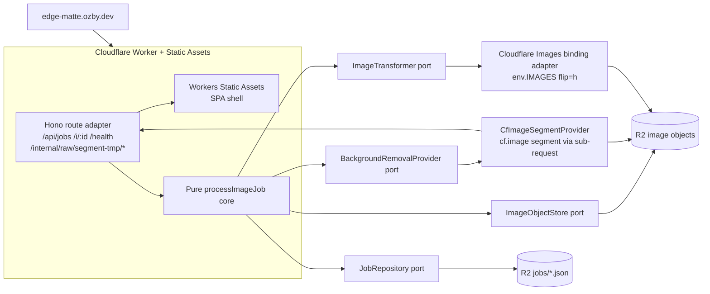
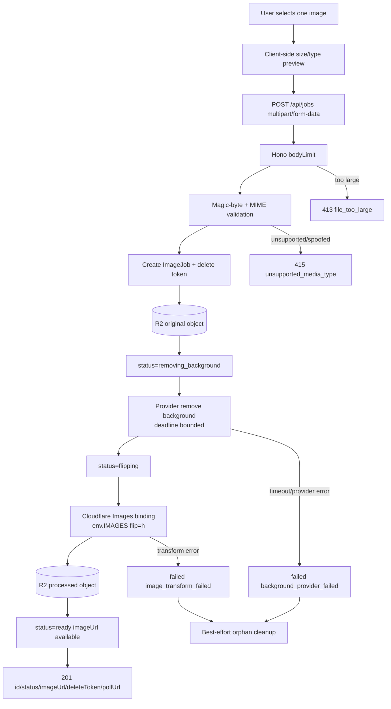
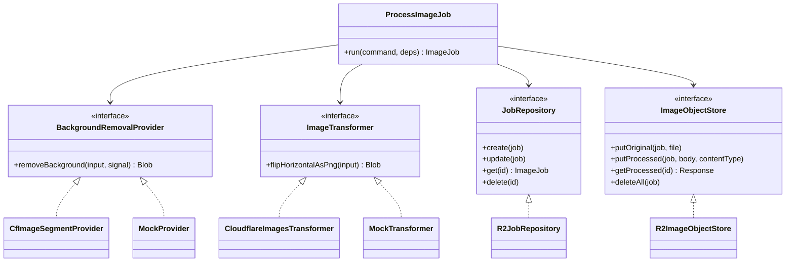
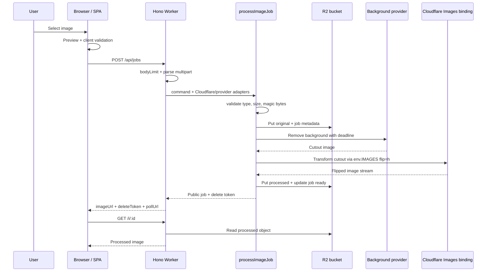
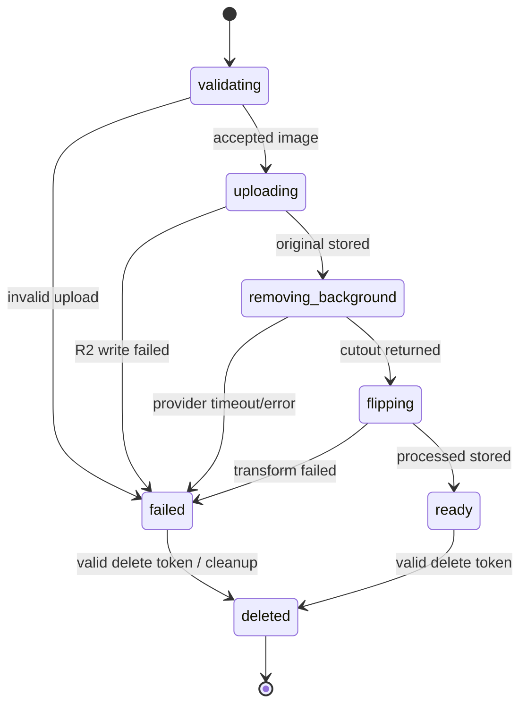
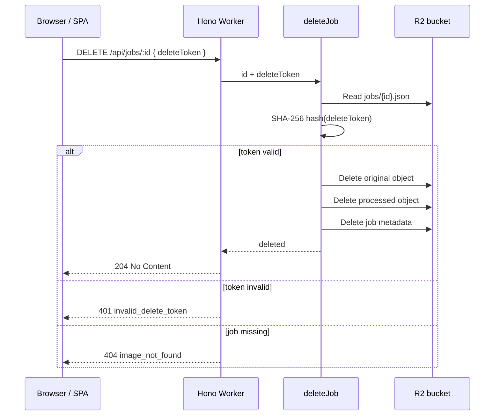
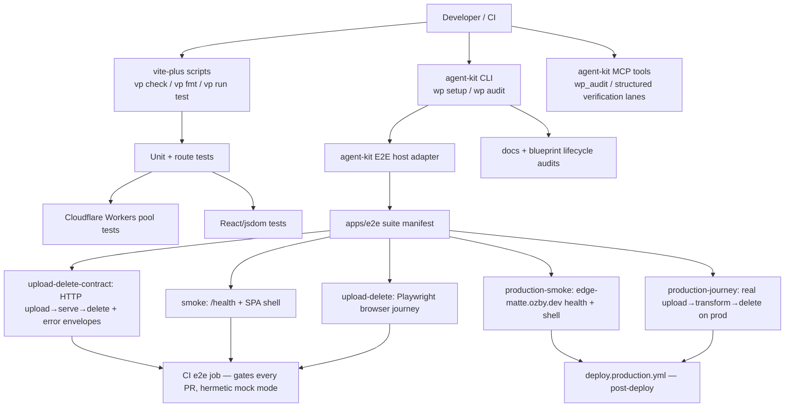
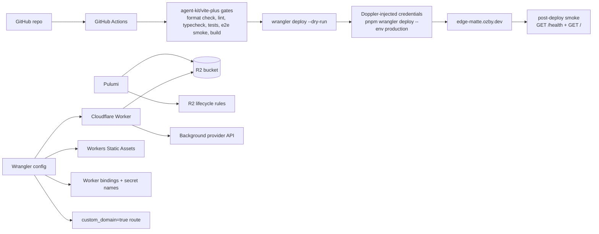
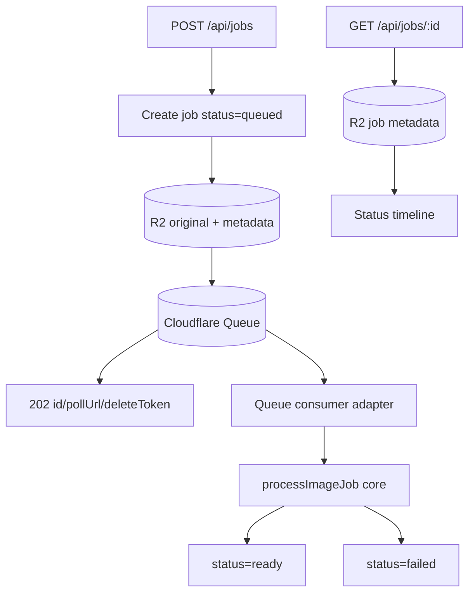

# Architecture

EdgeMatte is a Cloudflare-native image matting pipeline deployed at
`https://edge-matte.ozby.dev`. The v1 shape is deliberately small and stable:
**one Worker, static assets, one R2 bucket, one pure pipeline core**.

The public product flow is: upload one image, remove the background, flip the
result horizontally, host the processed artifact, expose safe job status, and
delete every artifact through a capability token.

## Architecture at a glance



The first implementation runs the processing runner inline. Queue mode is a
promotion adapter only; it should land after inline provider behavior proves a
real need for reliable out-of-band execution.

## Runtime request path



## Ports and adapters



This is the DRY/SOLID boundary: HTTP, provider APIs, image transforms, and R2
never leak into the pure pipeline core.

The image-transform adapter is concrete at the principal level: the horizontal
flip runs through the Cloudflare Images **Workers binding** rather than a vague
remote-URL-only assumption. The port returns a `Blob`; the adapter resolves the
CF Images response to bytes internally:

```ts
const result = await env.IMAGES.input(cutoutStream)
  .transform({ flip: "h" })
  .output({ format: "image/png" });
return (await result.response()).blob();
```

That keeps the brief’s order exact:

1. upload one image
2. remove background through a third-party provider
3. flip the cutout horizontally
4. host the processed artifact at `https://edge-matte.ozby.dev/i/:id`
5. delete original object, processed object, and metadata with the delete token

## Upload sequence



## Job state machine



`validating` is the initial in-memory status only. Upload rejections
(size, MIME, magic-byte) throw in `assertSupportedFile` **before** a job is
persisted, so the `validating --> failed` edge is the logical lifecycle, not a
stored `failed` record — no orphan metadata is written for a rejected upload.
A persisted `failed` job is only produced once processing has begun
(`uploading` onward).

Only safe status values and coarse error codes are exposed publicly. Provider
payloads, internal stack traces, object keys, and token hashes stay private.

## Storage layout

```mermaid
flowchart TD
    ID[job id job_...] --> META[jobs/{id}.json<br/>ImageJob metadata]
    ID --> ORIGINAL[images/{id}/original<br/>source upload]
    ID --> PROCESSED[images/{id}/processed<br/>background removed + flipped]
    TMP[segment-tmp/{ts}-{rand}<br/>transient blob for cf.image sub-request<br/>deleted in CfImageSegmentProvider.finally]

    META --> SAFE[PublicJobResponse<br/>id status imageUrl timestamps errorCode]
    META --> SECRET[Private fields<br/>deleteTokenHash object keys]
    ORIGINAL --> CLEANUP[deleteAll]
    PROCESSED --> CLEANUP
    META --> CLEANUP
```

R2 is the only persistence layer in v1. This avoids a database while still making
artifact lifecycle explicit and testable.

## Principal requirement traceability

| task.pdf requirement                       | Architecture contract                                                                                                                               |
| ------------------------------------------ | --------------------------------------------------------------------------------------------------------------------------------------------------- |
| Upload a single image                      | `POST /api/jobs` accepts exactly one multipart file after client + server validation.                                                               |
| Remove background via third-party service  | `BackgroundRemovalProvider` port with `CfImageSegmentProvider` production adapter (Cloudflare's BiRefNet via the `cf.image segment` CDN transform). |
| Flip horizontally after background removal | `ImageTransformer` port with Cloudflare Images Workers binding adapter using `flip=h`.                                                              |
| Host processed image online at unique URL  | Worker serves `GET /i/:id` on `https://edge-matte.ozby.dev`.                                                                                        |
| Delete uploaded and processed images       | `DELETE /api/jobs/:id` deletes original object, processed object, and job metadata.                                                                 |
| Backend must be TypeScript                 | Worker/core/adapters are TypeScript-only surfaces.                                                                                                  |
| Full stack deployed online                 | Worker + static assets deploy together to `edge-matte.ozby.dev`.                                                                                    |
| Code shared in GitHub repository           | Blueprint/release flow assumes public GitHub review target.                                                                                         |

## Delete flow



The delete token is a capability. Losing it is unrecoverable by design because
v1 has no user accounts.

## Quality and E2E reuse



The three hermetic suites (`upload-delete-contract`, `smoke`, `upload-delete`)
gate every PR via the CI `e2e` job using `wrangler dev` + `E2E_MOCK_PIPELINE:1`
— no secrets, deterministic. `production-journey` runs post-deploy against live
prod and is the only suite that asserts the real `cf.image` transform (output
bytes differ from input); the mock pipeline is a pass-through and cannot.

Quality gates are adopted from the Webpresso/IngestLens pattern rather than
reinvented locally. EdgeMatte should keep only project-specific journey files and
suite registration in `apps/e2e`; execution planning, structured QA lanes,
formatting, test presets, and blueprint audits come from agent-kit/vite-plus.

## Infrastructure deployment ownership

Release/bootstrap companions:
[`docs/release.md`](./release.md) and [`infra/README.md`](../infra/README.md).



Boundary rule: Pulumi owns durable infrastructure. Wrangler owns Worker-scoped
deployment, static assets, routes, bindings, and secret names. Provider secret
values live in Cloudflare, not GitHub.

## Optional queue execution



Queue mode reuses the same ports and `processImageJob` core. It is valuable only
after inline mode proves that provider latency/reliability requires it.

## Governance

`docs/architecture.md` is the human-readable architecture source of truth.
`docs/architecture.contract.json` is the machine-checkable contract that active
blueprints must link and satisfy.

Architecture-changing blueprints must:

- link `docs/architecture.md`
- link `docs/architecture.contract.json`
- include `## Architecture before`
- include `## Architecture after`

Shared enforcement for EdgeMatte, IngestLens, and sibling repos:

```bash
wp audit architecture-drift --root .
```
