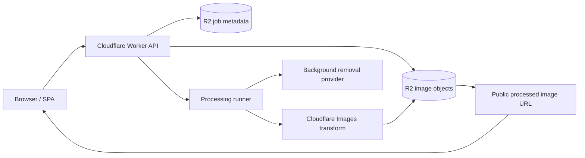
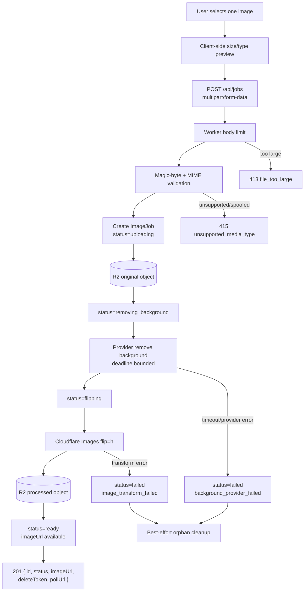
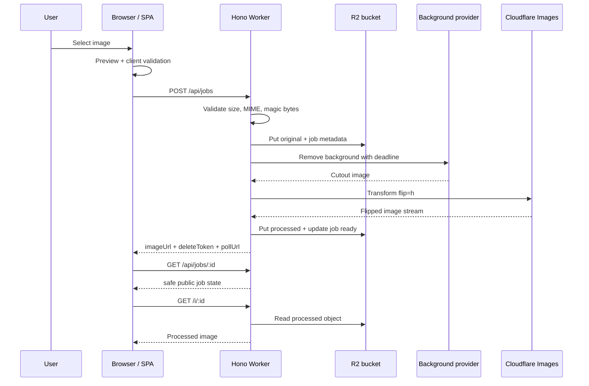
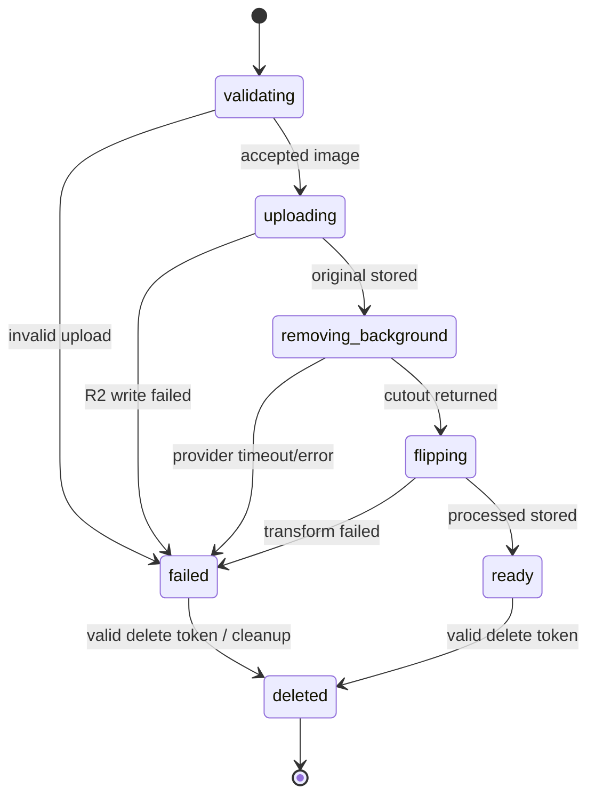
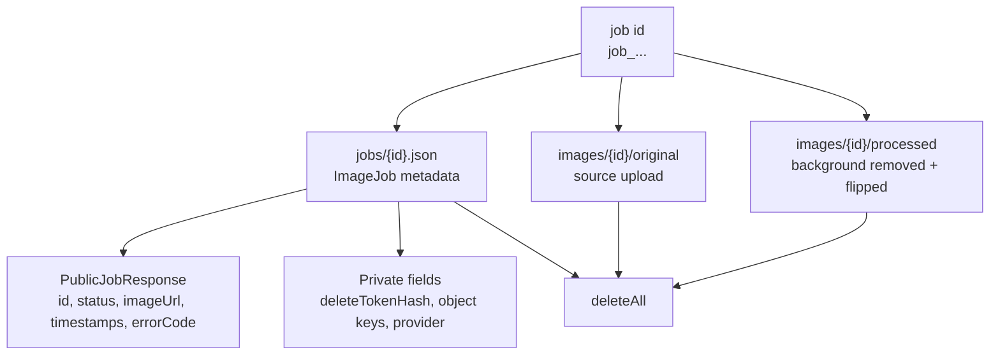
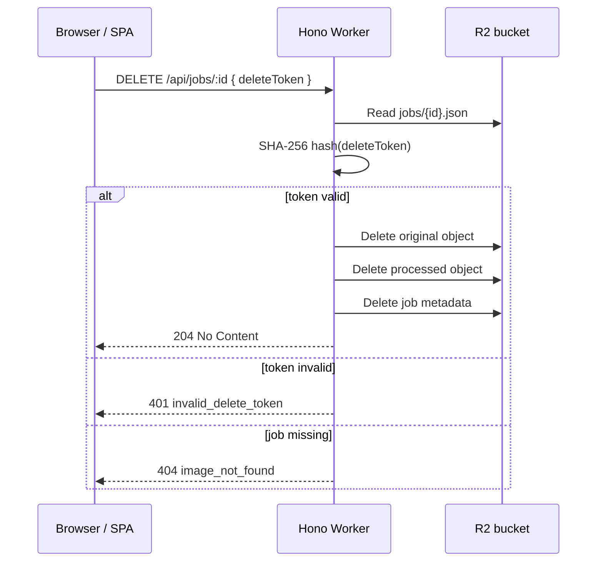
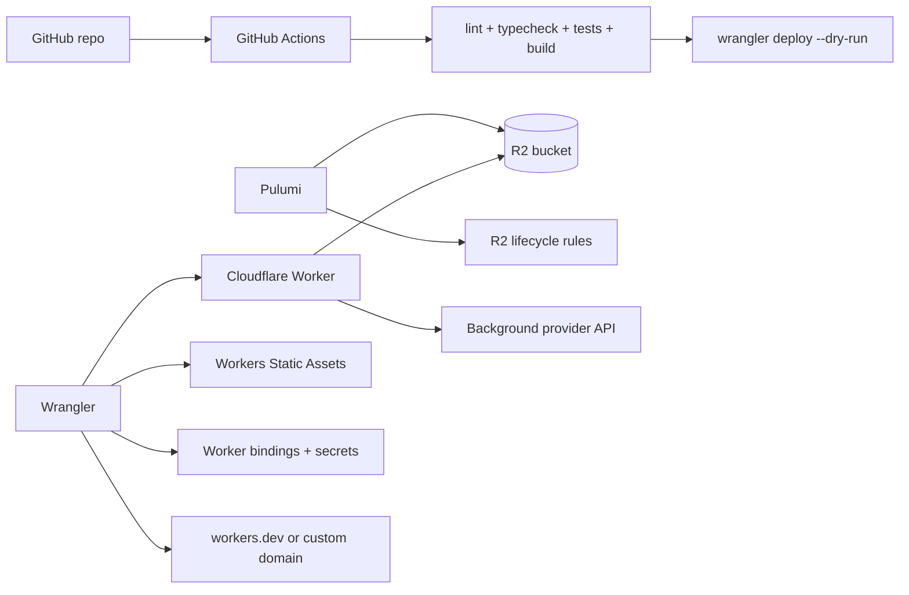
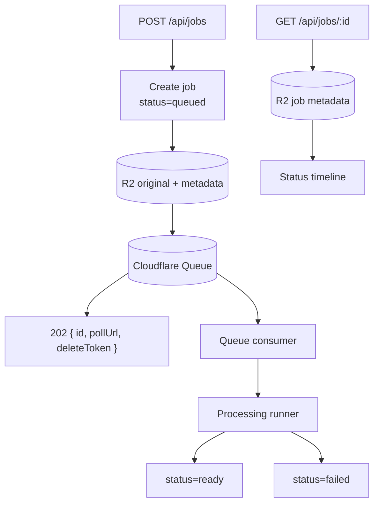

# Architecture

EdgeMatte is a Cloudflare-native image matting pipeline. The first public slice
is intentionally small: one image in, one processed URL out, one capability token
to delete every stored artifact. The internals are platform-shaped so future
async execution, retries, and additional providers can land without rewriting the
user-facing flow.

## Architecture at a glance

The first implementation runs the processing runner inline. Queue mode is a
future execution adapter, not a separate product path.

## Runtime request path

## Upload sequence

## Job state machine

Only safe status values and coarse error codes are exposed publicly. Provider
payloads, internal stack traces, object keys, and token hashes stay private.

## Storage layout

R2 is the only persistence layer in v1. This avoids a database while still making
artifact lifecycle explicit and testable.

## Delete flow

The delete token is a capability. Losing it is unrecoverable by design because
v1 has no user accounts.

## Deployment ownership

Boundary rule: Pulumi owns durable infrastructure. Wrangler owns Worker-scoped
deployment, static assets, routes, bindings, and secrets.

## Optional queue execution

Queue mode is valuable only after the inline runner proves the provider and
transform path. It should not block the first live demo.
