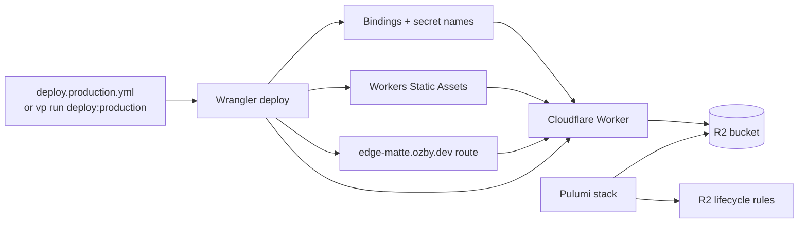

# EdgeMatte infrastructure (Pulumi)

Pulumi owns **durable** Cloudflare resources for EdgeMatte. Wrangler owns the Worker,
routes, bindings, and deploy — see [`apps/workers/wrangler.toml`](../apps/workers/wrangler.toml) and
[`docs/release.md`](../docs/release.md).

See also:

- [`docs/architecture.md#infrastructure-deployment-ownership`](../docs/architecture.md#infrastructure-deployment-ownership) — system-wide deployment ownership Mermaid chart
- [`docs/release.md`](../docs/release.md) — release path, smoke checks, and maintainer bootstrap

## Deployment chart



Boundary summary: Pulumi creates and manages durable infrastructure. Wrangler
deploys the Worker-facing runtime that consumes it.

## Resources

| Resource     | Name / scope                                                                        |
| ------------ | ----------------------------------------------------------------------------------- |
| R2 bucket    | `edge-matte-images` (bound as `IMAGES_BUCKET` in Wrangler)                          |
| R2 lifecycle | Delete `jobs/*` and `images/*` objects older than `artifactMaxAgeDays` (default 30) |

Object key layout matches the Worker (`apps/workers/src/core/object-keys.ts`):

- `jobs/{id}.json` — job metadata
- `images/{id}/original` — upload
- `images/{id}/processed` — hosted result

## Prerequisites

- [Pulumi CLI](https://www.pulumi.com/docs/install/)
- Cloudflare account ID (`CLOUDFLARE_ACCOUNT_ID` or Pulumi config)
- API token with R2 read/write for the account

## Bootstrap

From the repo root:

```bash
vp install --frozen-lockfile
cd infra
pulumi login
pulumi stack init production   # once
with-secrets -- pulumi config set cloudflareAccountId "$CLOUDFLARE_ACCOUNT_ID" --secret
with-secrets -- pulumi config set artifactMaxAgeDays 30
vp run pulumi:preview        # from repo root, or: with-secrets -- pulumi preview
vp run pulumi:up
```

Or run Pulumi commands from `infra/` with `with-secrets --` so
`CLOUDFLARE_API_TOKEN` and `CLOUDFLARE_ACCOUNT_ID` load from Doppler
`ozby-shell` (configure: `wp config secrets set doppler ozby-shell`).

Account ID can also be set once in Pulumi stack config instead of relying on
Doppler env vars (ingest-lens pattern).

Then deploy the Worker with Wrangler (bucket must exist before production traffic).

## Verification

Repo-level infra contract tests (no Cloudflare credentials required):

```bash
cd ..
node --test test/infra/pulumi-ownership.test.ts
```

## Ownership

Do **not** create the R2 bucket or lifecycle rules in Wrangler. Do **not** deploy the
Worker from this stack.
